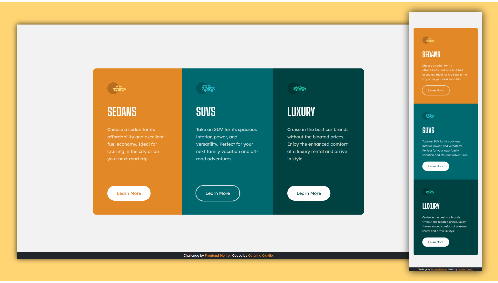

# Frontend Mentor - 3-column preview card component
## HTML - CSS - Responsive

This is a solution to the [3-column preview card component challenge on Frontend Mentor](https://www.frontendmentor.io/challenges/3column-preview-card-component-pH92eAR2-).

## Screenshot

### Links

- Live Site URL: [https://cataclas.github.io/Frontend-Mentor_3-column-preview-card-component/](https://cataclas.github.io/Frontend-Mentor_3-column-preview-card-component/)

## Built with

- Semantic HTML5 markup
- [CSS custom properties](https://devdocs.io/css/)
- Flexbox
- [Responsive](https://devdocs.io/css/@media)

## Author

- Frontend Mentor - [@Cataclas](https://www.frontendmentor.io/profile/Cataclas)
- GitHub - [Cataclas](https://github.com/Cataclas)